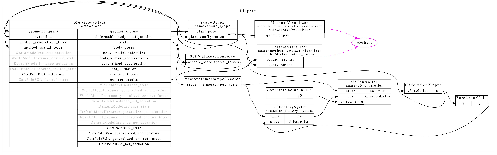
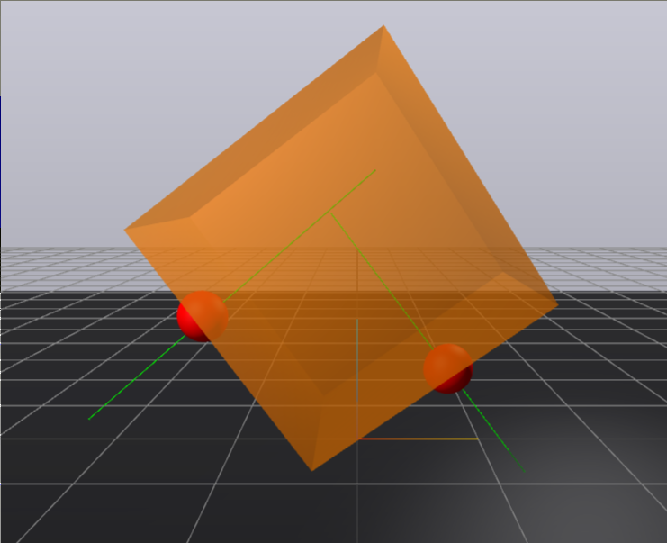

# C3 Standalone Example
This example (c3_example.cc) demonstrates how to set up and solve C3 problems for different systems (cartpole, finger gaiting, and pivoting) using only Eigen and the core C3 classes, without Drake dependencies. It is useful for understanding the core algorithm and for running C3 on custom LCS models.

## How to Run the C3 Standalone Example
From the root of the repository, build and run the example with:
```sh
# Build the example
bazel build //examples:c3_example

# Run the example
bazel run //examples:c3_example
```
By default, the example will run the finger gaiting problem. You can modify the `example` variable in `c3_example.cc` to select cartpole (`example = 0`), finger gaiting (`example = 1`), or pivoting (`example = 2`).

# C3 Controller Example

This example demonstrates the integration of a C3 controller with a cartpole system simulated using a Linear Complementarity System (LCS). The objective is to evaluate the controller's ability to stabilize the cartpole while following a desired state trajectory. Real-time visualization is provided via Meshcat and Drake's SceneGraph.

**System Architecture:**


## How to Run the Cartpole C3 Controller Example

From the root of the repository, build and run the example with:

```sh
# Build the example
bazel build //examples:c3_controller_example

# Run the example
bazel run //examples:c3_controller_example
```

---

# LCS Factory System Example

The cartpole with softwalls problem is modeled as a Linear Complementarity System (LCS) generated by the LCS factory. This LCS forms the basis for running the C3 controller, which stabilizes the cartpole while tracking predefined state trajectories.

**System Architecture Diagrams:**

Cartpole with Softwalls            |  Cube Pivoting
:-------------------------:|:-------------------------:
| 
| 

## How to Run the LCS Factory System Examples

### Build the example
```sh
# Build the cartpole LCS factory system example
bazel build //examples:lcs_factory_system_example
```
### Run the example
#### Cartpole with Softwalls
```sh
bazel run //examples:lcs_factory_system_example -- --experiment_type=cartpole_softwalls
```

#### Cube Pivoting
```sh
# Run the example
bazel run //examples:lcs_factory_system_example
```
# Python Examples
Several Python examples are provided in examples/python/. These use the pyc3 bindings and Drake's Python API.

## How to Run the Python Examples
From the root of the repository, you can build and run the Python examples as follows:

C3 Standalone Example (Python)
```sh
# Build and run the Python C3 standalone example
bazel run //examples/python:c3_example
```
C3 Controller Example (Python)
```sh
# Build and run the Python C3 controller example
bazel run //examples/python:c3_controller_example
```
LCS Factory Example (Python)
```sh
# Build and run the Python LCS factory example
bazel run //examples/python:lcs_factory_example
```
LCS Factory System Example (Python)
```sh
# Build and run the Python LCS factory system example
bazel run //examples/python:lcs_factory_system_example -- [--experiment_type cartpole_softwalls]
```
