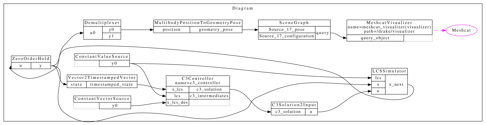

# C3 Controller Test

This test demonstrates the integration of a C3 controller with a cartpole system simulated using a Linear Complementarity System (LCS). The goal is to evaluate the controller's ability to stabilize the cartpole system while adhering to the desired state trajectory. The test includes visualization using Meshcat and Drake's SceneGraph, enabling real-time observation of the system's behavior.

The diagram below illustrates the system architecture used in this test:

  