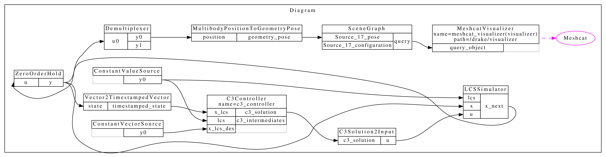
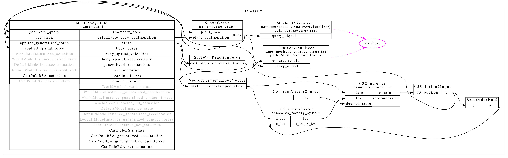
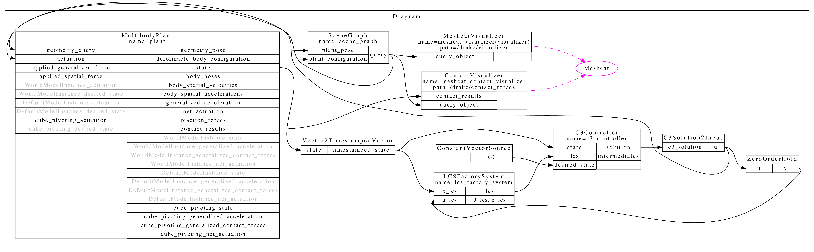
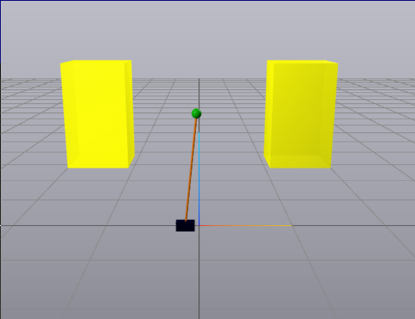
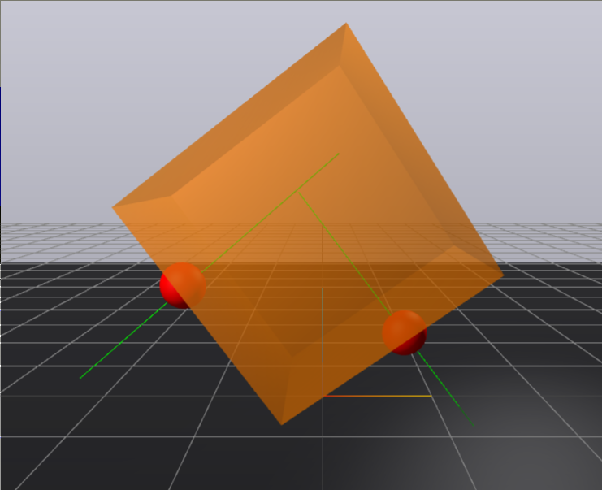

# C3 Controller Test

This test demonstrates the integration of a C3 controller with a cartpole system simulated using a Linear Complementarity System (LCS). The goal is to evaluate the controller's ability to stabilize the cartpole system while adhering to the desired state trajectory. The test includes visualization using Meshcat and Drake's SceneGraph, enabling real-time observation of the system's behavior.

The diagram below illustrates the system architecture used in this test:

  

# LCS Factory System Test

The interactions in the cartpole with softwall problem is modeled using as a Linear Complementarity System (LCS) generated by the LCS factory. The LCS serves as the foundation for running the C3 controller, which is tasked with stabilizing the cartpole system while adhering to predefined state trajectories. 

For a detailed view of the system architecture, refer to the diagram below:

Cartpole with Softwalls            |  Cube Pivoting
:-------------------------:|:-------------------------:
| 
| 